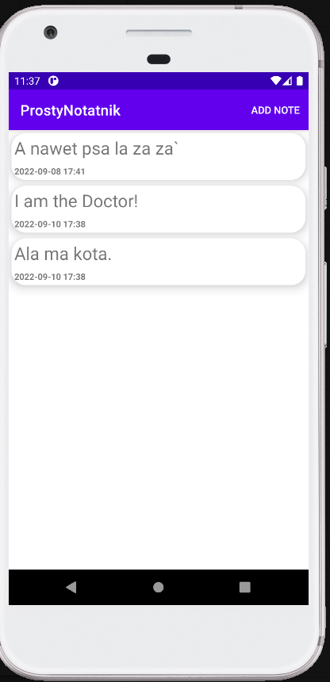

# ProstyNotatnik
App for keeping notes.

<h3>User can:</h3>

- save note,
- remove note,
- restore last removed note as long as app is running,
- update existing note.

<h3>Used technologies:</h3>

- finding views from layout with view binding,
- floating action button,
- shared preferences,
- Serializable interface fo saving notes as Strings,
- RecyclerView,
- on click and on long click listeners,
- Json for storing note objects as Strings,
- AlertDialog for asking user confirmation,
- custom options menu,

<h3>App screenshots:</h3>

Main screen, list of notes           |  Edit note screen
:-------------------------:|:-------------------------:
  |   

<h3>App during usage:</h3>

Remove and restore note           |  Update note
:-------------------------:|:-------------------------:
  |   
